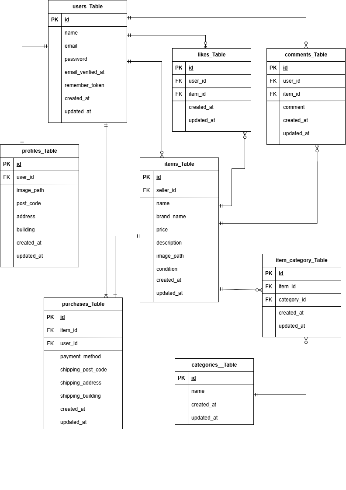

# flea-market(COACHTECHフリマアプリ)

##ER図  

##環境構築

git clone git@github.com:mii4573/flea-market.git  
cd flea-market  
docker-compose up -d --build  

##Laravel環境構築

docker-compose exec php bash  
composer install  
cp .env.example .env  
php artisan key:generate  
php artisan migrate:fresh --seed  
php artisan storage:link

##初期データについて  
動作に必要なユーザー、プロフィール、カテゴリー、商品データが自動的にデータベースに投入されます  

[全ての初期商品の出品者の情報を入れています]   
テスト太郎(ID:1)  
メールアドレス：test@example.com  
パスワード：password123  

[購入確認用ユーザー情報を入れています]  
テスト花子(ID:2)  
メールアドレス：hanako@example.com  
パスワード：password456 

##使用技術

-php 8.1 -fpm  
-Laravel 8.x (Fortify)  
-MySQL 8.0.26  
-nginx 1.21.1  
-Stripe (決済機能)  
-MailHog (メール認証確認)  

##開発環境

商品一覧：http://localhost  
phpMyAdmin:http://localhost:8080  
メール認証(MailHog)URL：http://localhost:8025  

##メール認証について  
(MailHog)URL：http://localhost:8025
にアクセスすることで、会員登録時に送信された認証メールを確認します

